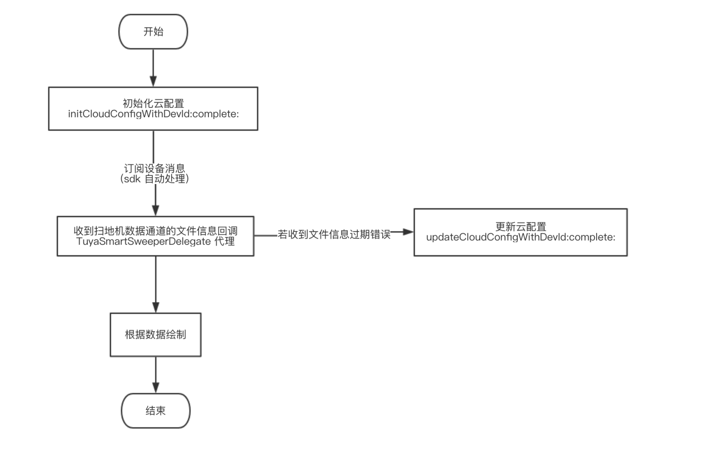

# iOS 激光扫地机 SDK 使用说明文档

## 功能概述

涂鸦智能 iOS 激光扫地机 SDK  在[涂鸦智能 iOS SDK](https://github.com/TuyaInc/tuyasmart_home_ios_sdk) （下文简介为: Home SDK）的基础上提供了接入激光扫地机功能接口封装，加速开发过程。主要包括了以下功能：

- 扫地机记录数据文件云配置转化
- 扫地机实时清扫记录获取
- 扫地机历史清扫记录获取


> 激光扫地机数据分为实时数据和历史记录数据。这两种数据都包含了地图数据和路径数据，以文件的形式存储在云端
>
>其中实时数据的地图和路径是分别存储在不同文件内，历史数据的地图和路径是存储在同一个文件内，根据指定规则进行拆分读取地图和路径数据


## 快速集成

### 使用 Cocoapods 集成

在 `Podfile` 文件中添加以下内容：

```ruby
platform :ios, '8.0'

target 'your_target_name' do

   pod "TuyaSmartSweeperKit", :git => "https://github.com/TuyaInc/tuyasmart_sweeper_ios_sdk.git"
   
end
```

然后在项目根目录下执行 `pod update` 命令，集成第三方库。

CocoaPods 的使用请参考：[CocoaPods Guides](https://guides.cocoapods.org/)

### 头文件导入

在需要使用的地方添加

```objective-c
#import <TuyaSmartSweeperKit/TuyaSmartSweeper.h>
```


## 功能说明

主要功能类为 `TuyaSmartSweeper`，实现`TuyaSmartSweeperDelegate` 来接受文件信息变化回调

**代码示例**

```objective-c
@property (strong, nonatomic) TuyaSmartSweeper *sweeper;

- (TuyaSmartSweeper *)sweeper {
    if (!_sweeper) {
        _sweeper = [[TuyaSmartSweeper alloc] init];
        _sweeper.delegate = self;
        // 设置自动下载文件数据
        _sweeper.shouldAutoDownloadData = YES;
    }
    
    return _sweeper;
}


#pragma mark - TuyaSmartSweeperDelegate

/**
 扫地机数据通道的文件信息回调
 
 @param sweeper sweeper
 @param devId 对应数据所属设备 Id
 @param mapType (0表示地图，1表示路径)
 @param mapData 地图数据
 @param error error
 */
- (void)sweeper:(TuyaSmartSweeper *)sweeper didReciveDataWithDevId:(NSString *)devId mapType:(NSInteger)mapType mapData:(NSData *)mapData error:(NSError *)error {
    NSLog(@"data %@  ---  error: %@", mapData, error);
}
```


### 数据流程




### 初始化云配置

```objective-c
/**
 初始化云配置
 
 @param devId 设备id
 @param complete 成功返回文件存储的bucket信息(用来获取文件的存储url)
 */
- (void)initCloudConfigWithDevId:(NSString *)devId
                        complete:(void(^)(NSString *bucket, NSError * _Nullable error))complete;
```


### 更新云配置

由于获取到的文件地址有时效性，当文件地址失效时，需要调用以下接口更新云配置

```objective-c
/**
 更新云配置
 
 @param devId 设备id
 @param complete 成功返回文件存储的bucket信息
 */
- (void)updateCloudConfigWithDevId:(NSString *)devId
                          complete:(void(^)(NSString *bucket, NSError * _Nullable error))complete;
```


### 获取数据文件地址 URL

获取到文件存储的 url 后，读取文件的数据进行显示

注意：实时数据和历史数据存储在不同的`bucket` 中

```objective-c
/**
 获取数据文件地址
 
 @param bucket 文件存储的bucket
 @param path 文件路径
 */
- (nullable NSString *)getCloudFileUrlWithBucket:(NSString *)bucket
                                            path:(NSString *)path;
```


### 获取扫地机历史记录

```objective-c
/**
 获取扫地机历史记录
 
 @param devId 设备id
 @param limit 一次获取数据的数量(建议最大不要超过100)
 @param offset 获取数据的偏移量(用于分页)
 @param startTime 起始时间戳
 @param endTime 结束时间戳
 @param complete 结果回调
 */
- (void)getSweeperHistoryDataWithDevId:(NSString *)devId
                                 limit:(NSUInteger)limit
                                offset:(NSUInteger)offset
                             startTime:(long)startTime
                               endTime:(long)endTime
                              complete:(void(^)(NSArray<TuyaSmartSweeperHistoryModel *> *datas, NSUInteger totalCount, NSError * _Nullable error))complete;

// -----------------------------------------------
// 历史记录模型
@interface TuyaSmartSweeperHistoryModel : NSObject

/**
 文件 id
 */
@property (copy, nonatomic) NSString *fileId;
/**
 时间戳
 */
@property (assign, nonatomic) long time;

/**
 文件拆分读取规则 (json字符串)
 */
@property (copy, nonatomic) NSString *extend;

/**
 文件存储的bucket
 */
@property (copy, nonatomic) NSString *bucket;

/**
 文件路径
 */
@property (copy, nonatomic) NSString *file;

@end
```


### 获取数据内容

备注：oss 错误分析：https://help.aliyun.com/document_detail/32005.html?spm=a2c4g.11186623.6.1328.609b28126VcNPW

```objective-c
/**
 获取数据内容

 @param bucket 文件存储的bucket
 @param path 文件路径
 @param complete 数据回调
 */
- (void)getSweeperDataWithBucket:(NSString *)bucket
                            path:(NSString *)path
                        complete:(void(^)(NSData *data, NSError * _Nullable error))complete;
```


### 获取实时的地图存储路径和路径存储路径

根据 `devId` 查询当前设备的实时地图/路径文件地址，获取到的路径通过 `[- (void)getSweeperDataWithBucket:]` 方法下载完整数据。

```objective-c
/**
 获取实时的地图存储路径和路径存储路径

 @param devId 设备 id
 @param complete 结果回调
 */
- (void)getSweeperCurrentPathWithDevId:(NSString *)devId
                              complete:(void(^)(NSString *mapPath, NSString *routePath, NSError * _Nullable error))complete;
```


### 删除扫地机历史记录

```objective-c
/**
 删除扫地机历史记录

 @param devId 设备 id
 @param fileIds 文件 id 数组
 @param complete 结果回调
 */
- (void)removeSweeperHistoryDataWithDevId:(NSString *)devId
                                  fileIds:(NSArray<NSString *> *)fileIds
                                 complete:(void (^)(NSError * _Nullable error))complete;
```

