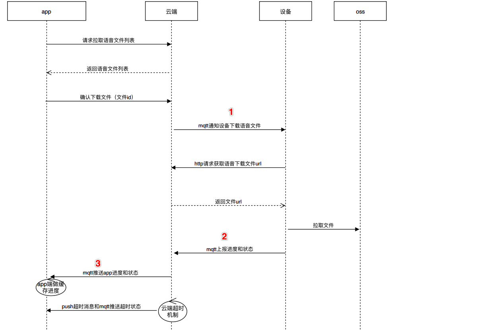

# Tuya Smart Sweeper iOS SDK

## Features Overview

Tuya Smart Sweeper App SDK

涂鸦智能 iOS 激光扫地机 SDK  在[涂鸦智能 iOS SDK](https://github.com/TuyaInc/tuyasmart_home_ios_sdk) （下文简介为: Home SDK）的基础上提供了接入激光扫地机功能接口封装，加速开发过程。主要包括了以下功能：

- 扫地机记录数据文件云配置转化
- 扫地机实时清扫记录获取
- 扫地机历史清扫记录获取
- 扫地机语音下载服务


> 激光扫地机数据分为实时数据和历史记录数据。这两种数据都包含了地图数据和路径数据，以文件的形式存储在云端
>
>其中实时数据的地图和路径是分别存储在不同文件内，历史数据的地图和路径是存储在同一个文件内，根据指定规则进行拆分读取地图和路径数据


## 快速集成

### 使用 Cocoapods 集成

在 `Podfile` 文件中添加以下内容：

```ruby
platform :ios, '8.0'

target 'your_target_name' do

   pod 'TuyaSmartSweeperKit'
   
end
```

然后在项目根目录下执行 `pod update` 命令，集成第三方库。

CocoaPods 的使用请参考：[CocoaPods Guides](https://guides.cocoapods.org/)

### 头文件导入

在需要使用的地方添加

```objective-c
#import <TuyaSmartSweeperKit/TuyaSmartSweeperKit.h>
```


## 功能说明

主要功能类为 `TuyaSmartSweeper`，实现`TuyaSmartSweeperDelegate` 来接受文件信息变化回调

**代码示例**

```objective-c
@property (strong, nonatomic) TuyaSmartSweeper *sweeper;

- (TuyaSmartSweeper *)sweeper {
    if (!_sweeper) {
        _sweeper = [[TuyaSmartSweeper alloc] init];
        _sweeper.delegate = self;
        // 设置自动下载文件数据
        _sweeper.shouldAutoDownloadData = YES;
    }
    
    return _sweeper;
}


#pragma mark - TuyaSmartSweeperDelegate

/**
 扫地机数据通道的文件信息回调
 
 @param sweeper sweeper
 @param devId 对应数据所属设备 Id
 @param mapType (0表示地图，1表示路径)
 @param mapData 地图数据
 @param error error
 */
- (void)sweeper:(TuyaSmartSweeper *)sweeper didReciveDataWithDevId:(NSString *)devId mapType:(NSInteger)mapType mapData:(NSData *)mapData error:(NSError *)error {
    NSLog(@"data %@  ---  error: %@", mapData, error);
}
```


### 数据流程


### 初始化云配置

```objective-c
/**
 初始化云配置
 
 @param devId 设备id
 @param complete 成功返回文件存储的bucket信息(用来获取文件的存储url)
 */
- (void)initCloudConfigWithDevId:(NSString *)devId
                        complete:(void(^)(NSString *bucket, NSError * _Nullable error))complete;
```


### 更新云配置

由于获取到的文件地址有时效性，当文件地址失效时，需要调用以下接口更新云配置

```objective-c
/**
 更新云配置
 
 @param devId 设备id
 @param complete 成功返回文件存储的bucket信息
 */
- (void)updateCloudConfigWithDevId:(NSString *)devId
                          complete:(void(^)(NSString *bucket, NSError * _Nullable error))complete;
```


### 获取数据文件地址 URL

获取到文件存储的 url 后，读取文件的数据进行显示

注意：实时数据和历史数据存储在不同的`bucket` 中

```objective-c
/**
 获取数据文件地址
 
 @param bucket 文件存储的bucket
 @param path 文件路径
 */
- (nullable NSString *)getCloudFileUrlWithBucket:(NSString *)bucket
                                            path:(NSString *)path;
```


### 获取扫地机历史记录

```objective-c
/**
 获取扫地机历史记录
 
 @param devId 设备id
 @param limit 一次获取数据的数量(建议最大不要超过100)
 @param offset 获取数据的偏移量(用于分页)
 @param startTime 起始时间戳
 @param endTime 结束时间戳
 @param complete 结果回调
 */
- (void)getSweeperHistoryDataWithDevId:(NSString *)devId
                                 limit:(NSUInteger)limit
                                offset:(NSUInteger)offset
                             startTime:(long)startTime
                               endTime:(long)endTime
                              complete:(void(^)(NSArray<TuyaSmartSweeperHistoryModel *> *datas, NSUInteger totalCount, NSError * _Nullable error))complete;

// -----------------------------------------------
// 历史记录模型
@interface TuyaSmartSweeperHistoryModel : NSObject

/**
 文件 id
 */
@property (copy, nonatomic) NSString *fileId;
/**
 时间戳
 */
@property (assign, nonatomic) long time;

/**
 文件拆分读取规则 (json字符串)
 */
@property (copy, nonatomic) NSString *extend;

/**
 文件存储的bucket
 */
@property (copy, nonatomic) NSString *bucket;

/**
 文件路径
 */
@property (copy, nonatomic) NSString *file;

@end
```


### 获取数据内容

备注：oss 错误分析：https://help.aliyun.com/document_detail/32005.html?spm=a2c4g.11186623.6.1328.609b28126VcNPW

```objective-c
/**
 获取数据内容

 @param bucket 文件存储的bucket
 @param path 文件路径
 @param complete 数据回调
 */
- (void)getSweeperDataWithBucket:(NSString *)bucket
                            path:(NSString *)path
                        complete:(void(^)(NSData *data, NSError * _Nullable error))complete;
```


### 获取实时的地图存储路径和路径存储路径

根据 `devId` 查询当前设备的实时地图/路径文件地址，获取到的路径通过 `[- (void)getSweeperDataWithBucket:]` 方法下载完整数据。

```objective-c
/**
 获取实时的地图存储路径和路径存储路径

 @param devId 设备 id
 @param complete 结果回调
 */
- (void)getSweeperCurrentPathWithDevId:(NSString *)devId
                              complete:(void(^)(NSString *mapPath, NSString *routePath, NSError * _Nullable error))complete;
```


### 删除扫地机历史记录

```objective-c
/**
 删除扫地机历史记录

 @param devId 设备 id
 @param fileIds 文件 id 数组
 @param complete 结果回调
 */
- (void)removeSweeperHistoryDataWithDevId:(NSString *)devId
                                  fileIds:(NSArray<NSString *> *)fileIds
                                 complete:(void (^)(NSError * _Nullable error))complete;
```


### 删除全部历史记录

```objective-c
/**
 删除当前扫地机所有历史记录

 @param devId 设备 id
 @param complete 结果回调
 */
- (void)removeAllHistoryDataWithDevId:(NSString *)devId
                             complete:(void (^)(NSError * _Nullable error))complete;
```


## 语音下载服务

### 功能说明



主要功能类为 `TuyaSmartFileDownload`，实现 `TuyaSmartFileDownloadDelegate` 来接收语音下载过程中的状态变化回调以及下载进度回调

```objective-c
- (TuyaSmartFileDownload *)fileDownloader {
    if (!_fileDownloader) {
        _fileDownloader = [TuyaSmartFileDownload fileDownloadWithDeviceId:@"<#devId#>"];
        _fileDownloader.delegate = self;
    }
    return _fileDownloader;
}


#pragma mark - TuyaSmartFileDownloadDelegate
/**
 文件下载状态

 @param fileDownload instance
 @param type 文件类型
 @param status 状态
 */
- (void)fileDownloadUpgrade:(TuyaSmartFileDownload *)fileDownload type:(NSString *)type status:(TuyaSmartFileDownloadStatus)status {
    NSLog(@"[LOG] %s: %@ status:%@", __PRETTY_FUNCTION__, type, @(status));
}

/**
 文件下载进度

 @param fileDownload instance
 @param type 文件类型
 @param progress 下载进度
 */
- (void)fileDownloadUpgrade:(TuyaSmartFileDownload *)fileDownload type:(NSString *)type progress:(int)progress {
    NSLog(@"[LOG] %s: %@ status:%@", __PRETTY_FUNCTION__, type, @(progress));
}
```


### 下载流程


### 获取下载信息

```objective-c
/**
 获取文件信息
 
 @param success 成功回调
 @param failure 失败回调
 */
- (void)getFileDownloadInfoWithSuccess:(nullable void (^)(NSArray<TuyaSmartFileDownloadModel *> *upgradeFileList))success
                               failure:(nullable TYFailureError)failure;
```


### 请求下载文件指令，设备开始下载文件

```objective-c
/**
 下发下载文件指令，设备开始下载文件, 升级成功或失败会通过 TuyaSmartFileDownloadDelegate 返回
 
 @param fileId  fileId of `TuyaSmartFileDownloadModel`
 @param success 成功回调 (status 0：未下载  1：下载中)
 @param failure 失败回调
 */
- (void)downloadFileWithFileId:(NSString *)fileId
                       success:(nullable TYSuccessID)success
                       failure:(nullable TYFailureError)failure;
```


### 获取文件下载进度

```objective-c
/**
 获取文件下载进度
 
 @param success 成功回调
 @param failure 失败回调
 */
- (void)getFileDownloadRateWithSuccess:(nullable void (^)(TuyaSmartFileDownloadRateModel *rateModel))success
                               failure:(nullable TYFailureError)failure;
```


### 下载信息回调

下发下载指令之后，设备开始下载，并且会通过 mqtt 将实时信息上报回来，通过下面这个代理方法可以接受设备下载的实时状态回调：

```objective-c
/**
 文件下载状态

 @param fileDownload instance
 @param type 文件类型
 @param status 状态
 */
- (void)fileDownloadUpgrade:(TuyaSmartFileDownload *)fileDownload type:(NSString *)type status:(TuyaSmartFileDownloadStatus)status;

```

根据上面的代理方法中的  `(TuyaSmartFileDownloadStatus)status` 来判断，若 `status` 的值为 `TuyaSmartFileDownloadStatusUpgrading`, 则触发该代理方法，获取下载进度

```objective-c
/**
 文件下载进度

 @param fileDownload instance
 @param type 文件类型
 @param progress 下载进度
 */
- (void)fileDownloadUpgrade:(TuyaSmartFileDownload *)fileDownload type:(NSString *)type progress:(int)progress;
```


### 下载文件数据模型

```objective-c
@interface TuyaSmartFileDownloadModel : NSObject

/**
 文件 id
 */
@property (copy, nonatomic) NSString *fileId;
/**
 产品 id
 */
@property (copy, nonatomic) NSString *productId;
/**
 文件名称
 */
@property (copy, nonatomic) NSString *name;
/**
 文件描述
 */
@property (copy, nonatomic) NSString *desc;
/**
 文件url
 */
@property (copy, nonatomic) NSString *auditionUrl;
/**
 正式文件url
 */
@property (copy, nonatomic) NSString *officialUrl;
/**
 文件图标url
 */
@property (copy, nonatomic) NSString *imgUrl;
/**
 区域码
 */
@property (strong, nonatomic) NSArray<NSString *> *region;

@end
```


### 下载文件的进度数据模型

```objective-c
@interface TuyaSmartFileDownloadRateModel : NSObject

/**
 下载文件 id
 */
@property (copy, nonatomic) NSString *fileId;
/**
 设备 id
 */
@property (copy, nonatomic) NSString *deviceId;
/**
 下载状态 0：未下载  1：下载中
 */
@property (assign, nonatomic) NSInteger status;
/**
 下载进度
 */
@property (assign, nonatomic) int rate;

@end
```


### 升级信息 

**0.1.3 -> 0.1.4**

- [x] [修改] : TuyaSmartSweeperDelegate 代理方法只返回当前初始化时传入的 devId 对应的设备接受到的 MQTT消息
- [x] [新增] : - (void)getSweeperDataWithBucket: 根据 bucket 和 path 下载文件，complete 回调 下载内容
- [x] [新增] : - (void)getSweeperDataWithBucket: 解析 OSS 错误信息，并返回 NSError
- [x] [新增] : - (void)getSweeperCurrentPathWithDevId: 获取实时的地图/路径的文件路径
- [x] [新增] : - (void)removeSweeperHistoryDataWithDevId: 删除扫地机历史记录

**0.1.4 -> 0.1.5**

- [x] [修改] : 获取历史记录接口调整，会根据所属家庭的纬度区分

**0.1.5 -> 0.1.6**

- [x] [新增] : 分享设备支持查看历史记录

**0.1.6 -> 0.1.7**

依赖版本 pod 'TuyaSmartDeviceKit', '~> 2.8.43'

- [x] [修改] : 支持 bitcode
- [x] [修改] : `- (void)getSweeperCurrentPathWithDevId:` 更新云配置的逻辑
- [x] [新增] : `- (void)removeAllHistoryDataWithDevId:` 清空当前扫地机历史记录

**0.1.7 -> 0.2.0**

依赖版本 pod 'TuyaSmartDeviceKit', '~> 2.10.96'

- [x] [废弃] : `-[TuyaSmartSweeperDelegate sweeper:didReciveDataWithDevId:mapType:mapPath:]` 接收激光数据通道消息
- [x] [新增] : `-[TuyaSmartSweeperDelegate sweeper:didReciveDataWithDevId:mapData:]` 接收激光数据通道消息

**0.2.0 -> 1.0.4**

依赖最新版本的 TuyaSmartDeviceKit

- [x] [bugfix] : Sweeper 对象销毁时，移除 delegate

**1.0.4 -> 1.0.5**

依赖最新版本的 TuyaSmartDeviceKit

- [x] [bugfix] : 修复偶现崩溃问题

**1.0.5 -> 1.0.6**

依赖最新版本的 TuyaSmartDeviceKit

- [x] [bugfix] : 去除 log 

**1.0.6 -> 1.0.7** 

- [x] [新增] : 语音下载服务 `TuyaSmartFileDownload` 
- [x] [bugfix] : 修复 `-[TuyaSmartSweeper sweeper:didReciveDataWithDevId:]` 回调当前设备的数据 